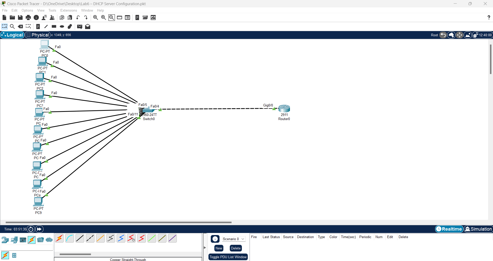
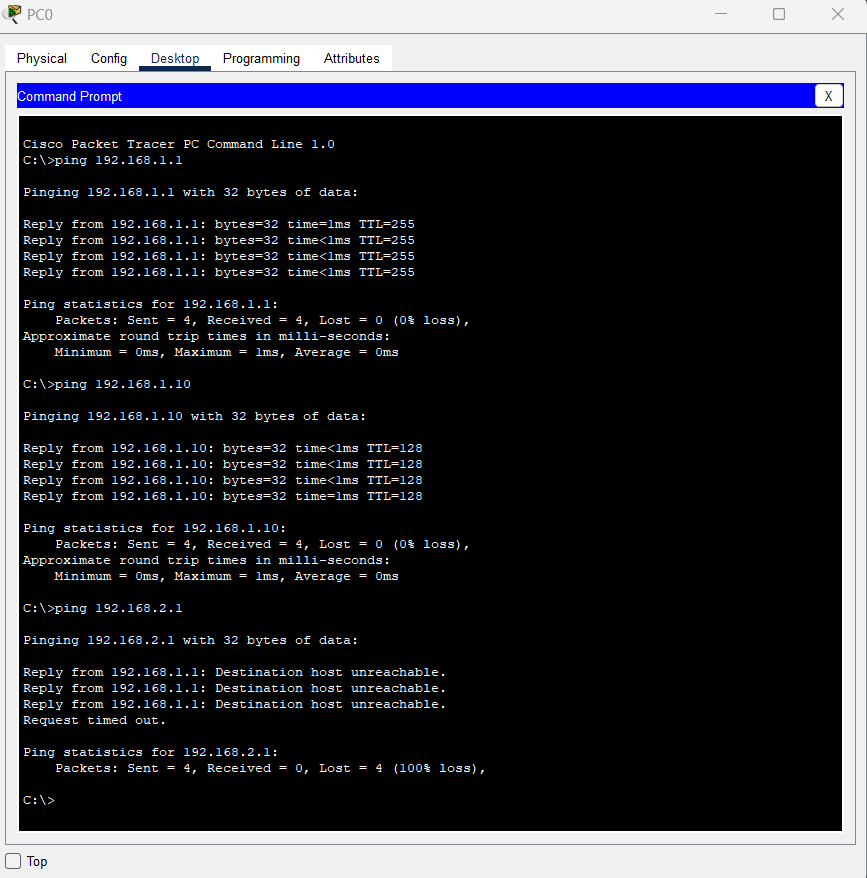

# Lab 1 – Simple LAN Network

## 🎯 الهدف
إنشاء شبكة LAN مكونة من 3 أجهزة كمبيوتر متصلة بسويتش، وضبط عناوين IP، واختبار الاتصال بينهم.

---

## 🛠 المتطلبات
- Cisco Packet Tracer
- Switch 2960
- 3 × PC
- 3 × Copper Straight-Through Cables

---

## 📍 خطوات الإعداد
1. افتح Cisco Packet Tracer.
2. اسحب 3 أجهزة PC وسويتش Switch 2960 إلى مساحة العمل.
3. وصل كل PC بالـ Switch باستخدام Copper Straight-Through Cable:
   - PC0 → FastEthernet0/1
   - PC1 → FastEthernet0/2
   - PC2 → FastEthernet0/3
4. اضبط عناوين الـ IP:
   - PC0 → `192.168.1.1 / 255.255.255.0`
   - PC1 → `192.168.1.2 / 255.255.255.0`
   - PC2 → `192.168.1.3 / 255.255.255.0`
5. اختبر الاتصال من PC0:
6. احفظ المشروع باسم `Lab1_SimpleLAN.pkt`.

---

## 📂 الملفات المرفقة
- [تحميل ملف Packet Tracer](./Lab1_SimpleLAN.pkt)

---

## 📸 صور اللاب

### Topology

### Ping Test

