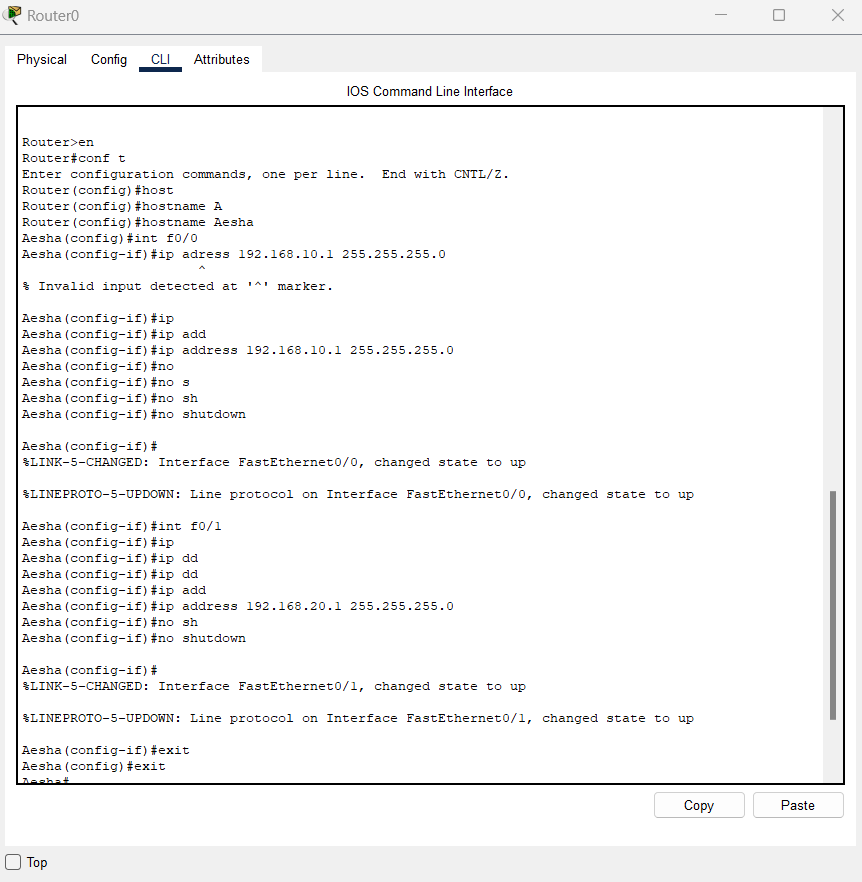

# Lab 2 – Basic Router Configuration & Inter-VLAN Routing

## 🎯 الهدف
توصيل شبكتين LAN مختلفتين عبر راوتر، مع إعداد الـ IP لكل واجهة، واختبار الاتصال بين الأجهزة.

---

## 🛠 المتطلبات
- Cisco Packet Tracer
- 1 × Router 1841
- 2 × Switch 2960
- 2 × PC
- 2 × Copper Straight-Through Cables
- 1 × Copper Cross-Over Cable

---

## 📍 خطوات الإعداد

### 1. توصيل الأجهزة
- PC0 → Switch0 (Fa0/1)  
- PC1 → Switch1 (Fa0/1)  
- Switch0 (Fa0/24) → Router0 (Fa0/0)  
- Switch1 (Fa0/24) → Router0 (Fa0/1)  

---

### 2. إعداد الـ IP على الـ PCs
- **PC0**  
  IP Address: `192.168.10.2`  
  Subnet Mask: `255.255.255.0`  
  Default Gateway: `192.168.10.1`

- **PC1**  
  IP Address: `192.168.20.2`  
  Subnet Mask: `255.255.255.0`  
  Default Gateway: `192.168.20.1`

---

### 3. إعداد الراوتر (CLI)
### 4. اختبار الاتصال
من **PC0**:
ping 192.168.20.2

من **PC1**:
ping 192.168.10.2

---

## 📂 الملفات المرفقة
- [تحميل ملف Packet Tracer](./Lab2_BasicRouterConfig.pkt)

---

## 📸 صور اللاب

### Topology

### CLI Configuration

### Ping Test

