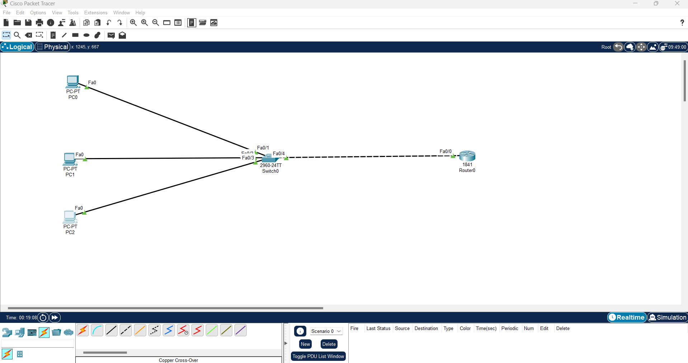
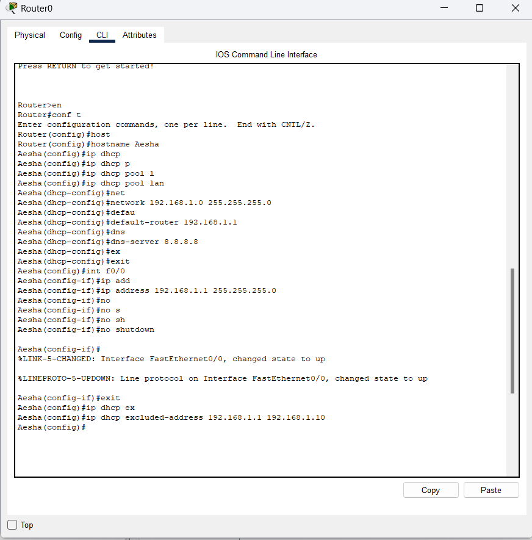
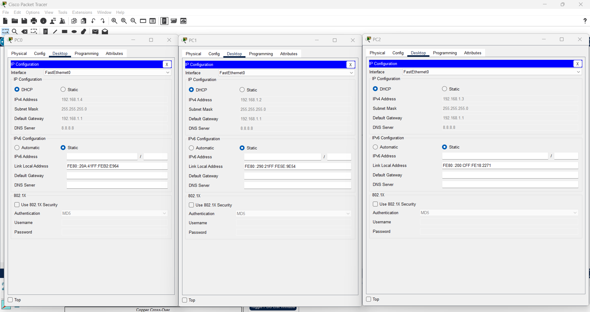
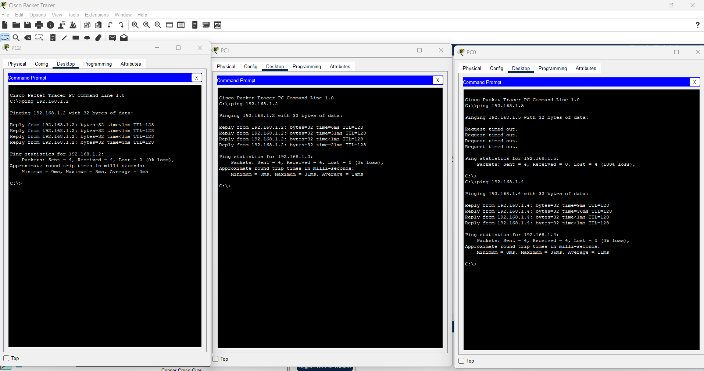

# Lab 3 – DHCP Server Configuration in a Network

## 🎯 الهدف
إعداد راوتر ليعمل كـ DHCP Server لتوزيع عناوين IP تلقائيًا على الأجهزة في الشبكة.

---

## 🖥️ الأجهزة المستخدمة
- Router 1841
- Switch 2960
- 3 PCs
- كابلات Straight Through

---

## 📡 خطوات الإعداد

### 1️⃣ تصميم الـ Topology

---

### 2️⃣ إعداد DHCP على الراوتر
- افتح CLI للراوتر.
- اكتب أوامر الإعداد.

 

---

### 3️⃣ ضبط إعدادات الـ PCs
- افتح أي PC → IP Configuration → اختر **DHCP**.

---

### 4️⃣ اختبار الاتصال

---

## 📂 ملفات اللاب
- [Packet Tracer File – Lab3_DHCP_Network.pkt](Lab3_DHCP_Network.pkt)

