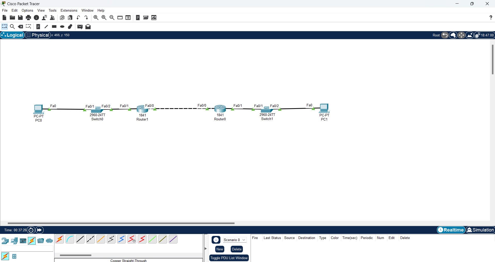
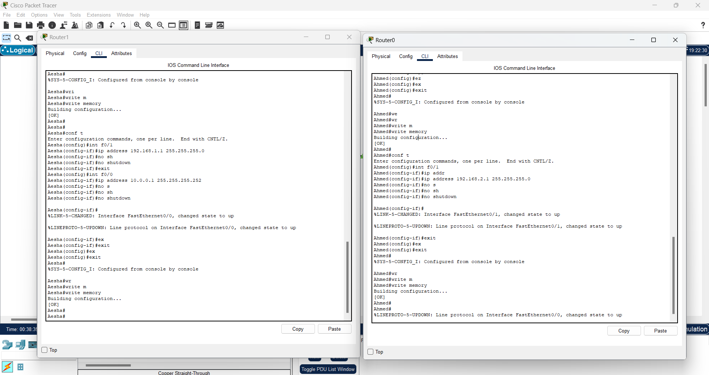
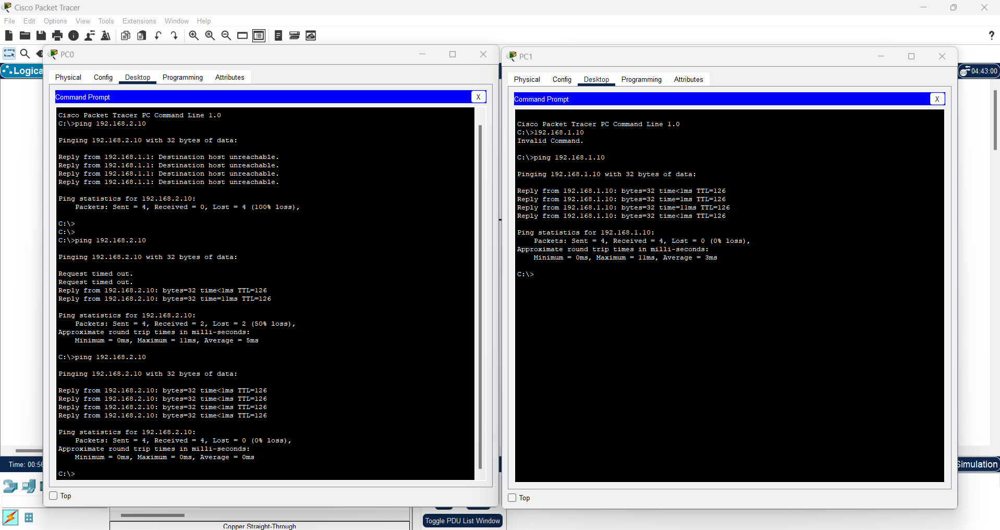

# Lab 4 – Static Routing Configuration

## 🎯 الهدف
ربط شبكتين مختلفتين باستخدام Static Routes بدون بروتوكولات ديناميكية.

---

## 🖥 الأجهزة المستخدمة
- 2 × Router 2911
- 2 × Switch 2960
- 2 × PC
- كابلات Straight Through + Cross Over

---



## 📌 خطوات الإعداد
1. إعداد IP لكل Interface:
   - **R1**
     ```
     interface fa0/1
     ip address 192.168.1.1 255.255.255.0
     no shutdown

     interface fa0/0
     ip address 10.0.0.1 255.255.255.252
     no shutdown
     ```

   - **R2**
     ```
     interface fa0/1
     ip address 192.168.2.1 255.255.255.0
     no shutdown

     interface fa0/0
     ip address 10.0.0.2 255.255.255.252
     no shutdown
     ```

2. إضافة Static Routes:
   - **R1**
     ```
     ip route 192.168.2.0 255.255.255.0 10.0.0.2
     ```
   - **R0**
     ```
     ip route 192.168.1.0 255.255.255.0 10.0.0.1
     ```


3. إعداد الـ PCs بالـ IP والـ Default Gateway.

4. اختبار الاتصال بين الشبكتين باستخدام `ping`.

---



---

## 📂 ملفات اللاب
- [Packet Tracer File – Lab4_Static_Routing.pkt](Lab4_Static_Routing.pkt)
