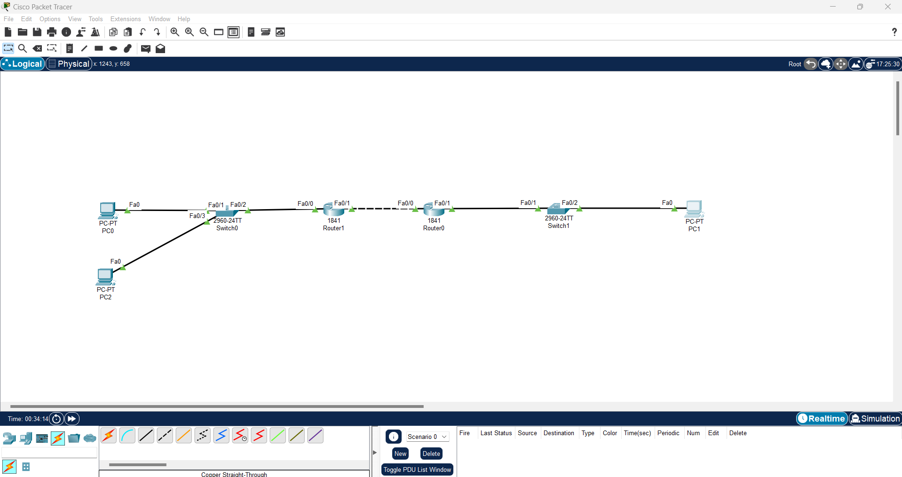
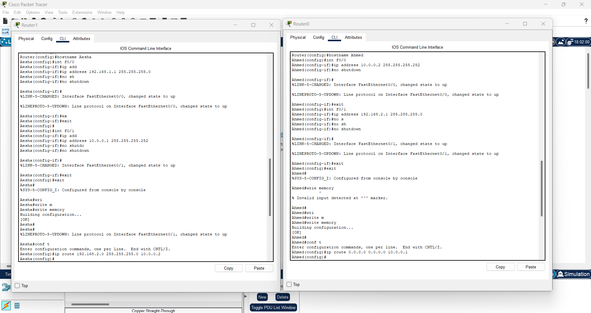
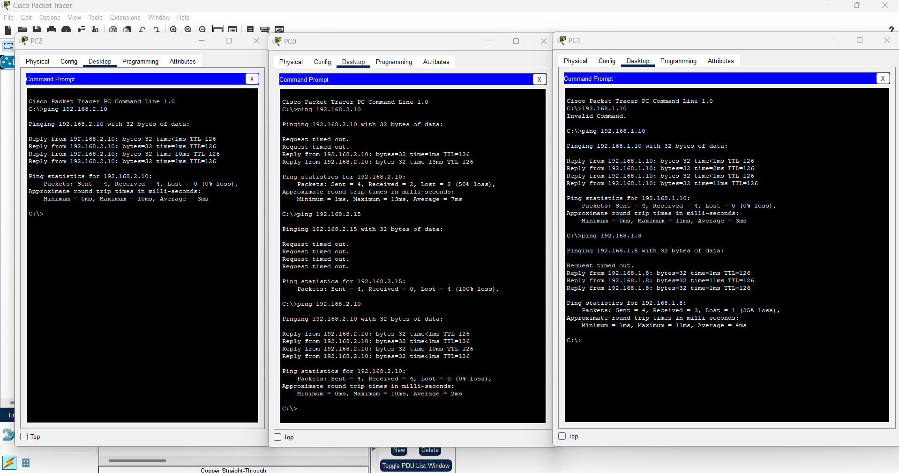

# Lab 5 – Default Route & Stub Network

## 🎯 الهدف
فهم كيفية استخدام الـ Default Route في الشبكات الطرفية (Stub Networks) لتبسيط إعدادات التوجيه.

---

## 🖥️ الأجهزة المستخدمة
- Router1 (R0)
- Router2 (R1)
- Switch1, Switch2
- PC1, PC2,PC3

---

## 🔌 التوصيل
- PC1,PC2 → Switch1 → R1 (Fa0/0)
- R1 (Fa0/1) ↔ R0 (Fa0/1)
- R0 (Fa0/0) → Switch2 → PC2

---

## 📡 إعدادات IP
| الجهاز | المنفذ | IP Address | Subnet Mask |
|--------|--------|------------|-------------|
| PC0    | NIC    | 192.168.1.10 | 255.255.255.0 |
| PC2    | NIC    | 192.168.1.10 | 255.255.255.0 |
| R1     | Fa0/0  | 192.168.1.1  | 255.255.255.0 |
| R1     | Fa0/1  | 10.0.0.1     | 255.255.255.252 |
| R0     | Fa0/1  | 10.0.0.2     | 255.255.255.252 |
| R0     | Fa0/0  | 192.168.2.1  | 255.255.255.0 |
| PC1    | NIC    | 192.168.2.10 | 255.255.255.0 |

---

## ⚙️ خطوات الإعداد

### على R1 وR0 كما موضح في الصورة 

✅ اختبار الاتصال

من PC1 → Ping إلى PC2

من PC2 → Ping إلى PC1

## 📁 ملفات اللاب
[ملف Packet Tracer](Lab5_Default_Route_Stub_Network.pkt)

