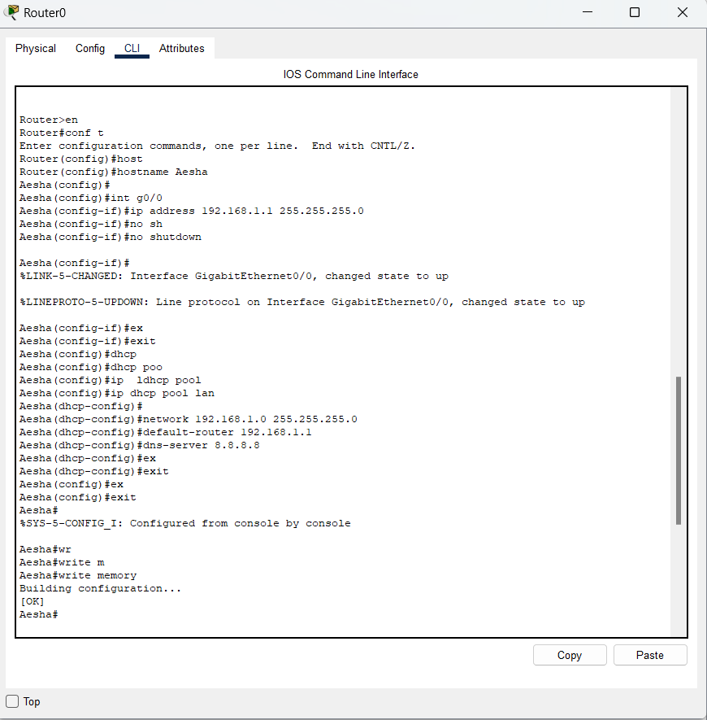
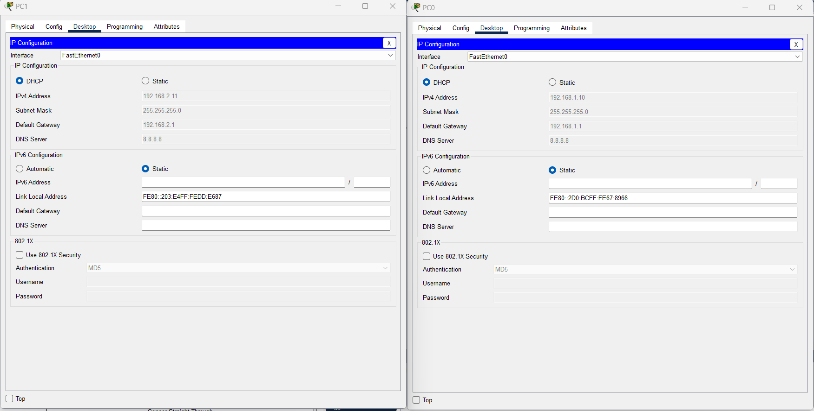

# Lab 6 - DHCP Configuration on Router

## 📌 الفكرة
في هذا اللاب قمنا بتهيئة الراوتر ليعمل كخادم DHCP لتوزيع عناوين IP تلقائيًا على الأجهزة المتصلة بالسويتش.

---
المكونات :
1.راوتر مركزي
1.سويتش 
عدد من الأجهزة
كابلات

## 🖥 التوصيل :

---

## ⚙ إعدادات الراوتر (CLI)

🖥 إعدادات أحد الأجهزة (IP Configuration)

🔍 اختبار الاتصال (Ping Test)

## 📁 ملفات اللاب
[تحميل ملف Packet Tracer](Lab6_DHCP_Router.pkt)
