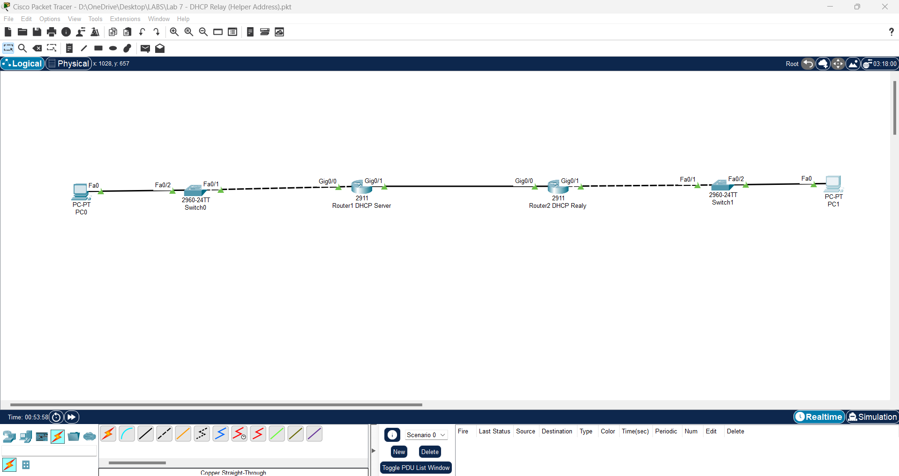
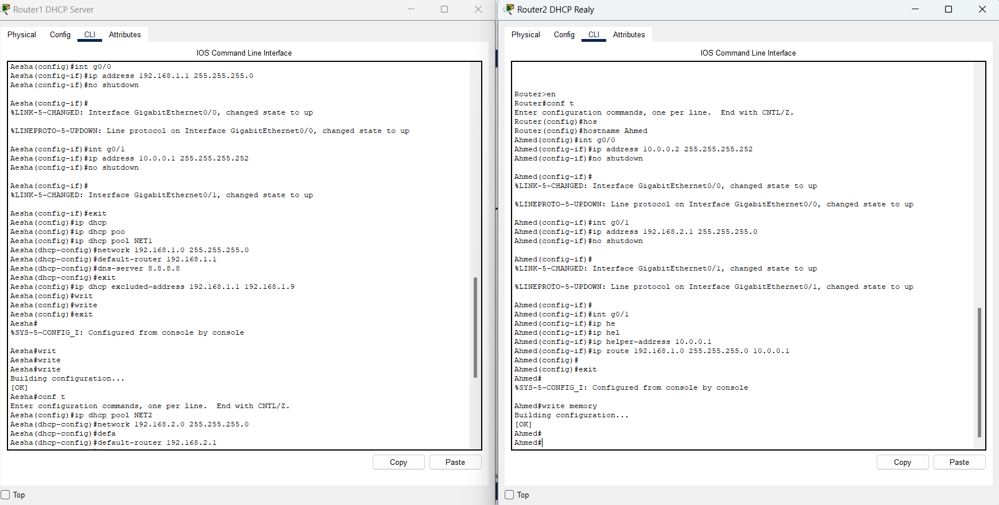
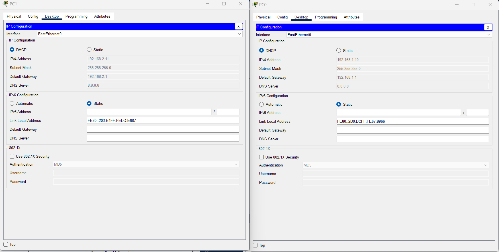
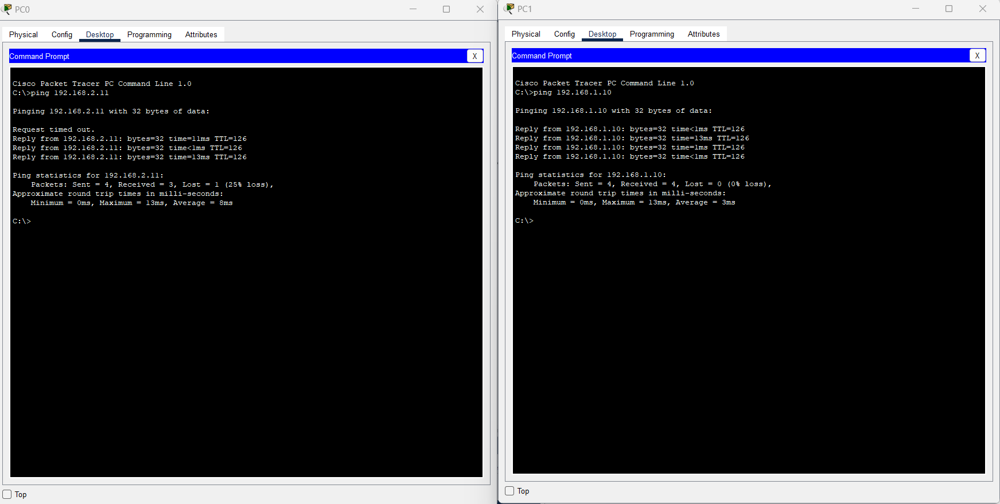

# Lab 7 - DHCP Relay (Helper Address)

## 📌 الفكرة
في هذا اللاب قمنا بعمل DHCP Server على R1 بحيث يوزع عناوين IP على الأجهزة المتصلة به مباشرة.  
أما الأجهزة المتصلة بـ R2 فهي لا تتصل مباشرة بخادم DHCP، لذلك استخدمنا خاصية **ip helper-address** لتمرير طلبات DHCP من R2 إلى R1.

---

## 🖥 التوبولوجي

---

## ⚙ إعدادات R1 (DHCP Server)
⚙ إعدادات R2 (DHCP Relay)

## 🖥 إعدادات الأجهزة

---

## 🔍 اختبار الاتصال (Ping Test)

---

## 📁 ملفات اللاب
[تحميل ملف Packet Tracer](Lab7_DHCP_Relay.pkt)
